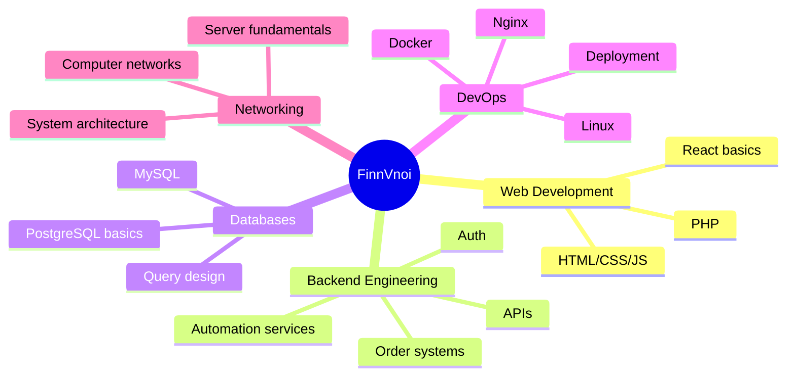

<div align="center">

<!-- HERO -->


<br />
<br />

<a href="https://finnvnoi.top/nuoitoi">
  
</a>
<a href="https://shop.finnvnoi.top">
  
</a>
<a href="mailto:nguyen0971539604@gmail.com">
  
</a>
<a href="https://github.com/FinnVnoi">
  
</a>

</div>

---

##  About Me

<table>
  <tr>
    <td width="58%">
      <p>
        Hi, I'm <b>Doan Dang Nguyen</b> — a student of <b>Computer Networks and Data Communications</b> at the <b>University of Information Technology, VNU-HCM</b>.
      </p>
      <p>
        I like building things that are not only written in code, but also <b>deployed, tested, and actually usable</b>. My current focus is the intersection of <b>web development</b>, <b>backend systems</b>, <b>databases</b>, <b>Linux servers</b>, <b>DevOps</b>, and <b>network engineering</b>.
      </p>
    </td>
    <td width="42%" align="center">
      
    </td>
  </tr>
</table>

```txt
> build something useful
> deploy it on a real server
> break it
> debug it
> learn why it broke
> rebuild it better
```

- 🎓 Studying **Computer Networks & Data Communications** at UIT - VNUHCM
- 🌐 Building real-world web apps and services with public domains
- 🧠 Interested in **Backend**, **DevOps**, **Databases**, **Networking**, and **Automation**
- 🛠️ Comfortable working with Linux servers, Nginx, PHP/MySQL, JavaScript, and Python
- 🤖 Former robotics competition participant with provincial achievements
- 🚀 Goal: become an engineer who understands both **software** and **infrastructure**

---

## 🧰 Tech Arsenal

<div align="center">

### Languages


### Frameworks / Runtime / Backend


### Tools / Platforms

<p>
  
  
  
  
  
  
  
  
  
  
  
</p>

</div>

<br />

```yaml
main_stack:
  web: [HTML, CSS, JavaScript, PHP]
  backend: [PHP, Python, Node.js, FastAPI]
  database: [MySQL, PostgreSQL]
  devops: [Linux, Ubuntu, Docker, Nginx, Apache, Git, Bash, Cloudflare]
  networking: [Computer Networks, Server Deployment, System Fundamentals]
currently_learning:
  - Data Structures & Algorithms
  - Object-Oriented Programming
  - Database Design
  - Docker & CI/CD
  - Backend Architecture
  - Network Engineering
```

---

## 🚀 Featured Projects

<table>
  <tr>
    <td width="50%">
      <h3>🌐 FinnVnoi Website</h3>
      <p>
        A personal website with online games and interactive features, deployed on a real domain and server.
      </p>
      <p>
        <b>Tech:</b> HTML, CSS, JavaScript, PHP, MySQL, Linux, Nginx
      </p>
      <a href="https://finnvnoi.top/nuoitoi">
        
      </a>
    </td>
    <td width="50%">
      <h3>🛒 FinnVnoi Shop</h3>
      <p>
        A mini e-commerce platform with product management, cart flow, authentication, voucher/order logic, and payment-oriented workflows.
      </p>
      <p>
        <b>Tech:</b> PHP, MySQL, HTML, CSS, JavaScript
      </p>
      <a href="https://shop.finnvnoi.top">
        
      </a>
    </td>
  </tr>
  <tr>
    <td width="50%">
      <h3>🤖 Telegram Engagement Service</h3>
      <p>
        A Telegram automation service for increasing channel/group interaction, managing users, automating tasks, and tracking statistics.
      </p>
      <p>
        <b>Tech:</b> Python, Telethon API, MySQL
      </p>
    </td>
    <td width="50%">
      <h3>🏁 Robotics Competition</h3>
      <p>
        Designed and built robots in a team environment, worked on control logic, mechanical decisions, and competition strategy.
      </p>
      <p>
        <b>Highlights:</b> Provincial Third Prize in Grade 10 and Grade 11
      </p>
    </td>
  </tr>
</table>

---

## 🧭 Engineering Map

<div align="center">



</div>

---

## 📈 Learning Progress

```txt
Backend Development      ████████░░  80%
Web Development          ████████░░  80%
Database Design          ███████░░░  70%
Linux Server Deploy      ███████░░░  70%
Networking Fundamentals  ██████░░░░  60%
Data Structures & Algo   ██████░░░░  60%
Docker & CI/CD           █████░░░░░  50%
```

---

## 🏆 Achievements

- 🥉 **Third Prize** — Provincial Robotics Competition, Grade 10
- 🥉 **Third Prize** — Provincial Robotics Competition, Grade 11
- 🤖 Robotics team member: robot design, control systems, and teamwork under pressure
- 🌍 **IELTS 5.5**
- 💻 Practicing algorithms on **LeetCode** and **Codeforces**
- 🌐 Built and deployed real websites/services on personal domains

---

## 📊 GitHub Analytics

<div align="center">


<br />
<br />


<br />
<br />


</div>

---

## ⚡ What I'm Building Toward

```txt
Software that works locally is good.
Software that runs on a real server is better.
Software that survives users, bugs, logs, traffic, and bad days — that's engineering.
```

I'm currently growing toward roles such as:

- **Backend Developer**
- **Web Developer**
- **DevOps Engineer**
- **Network Engineer**
- **Data Engineer**

My long-term direction is to become the kind of engineer who can design, build, deploy, monitor, and improve complete systems.

---

## 🌍 Connect With Me

<div align="center">

<a href="https://finnvnoi.top/nuoitoi">
  
</a>
<a href="https://shop.finnvnoi.top">
  
</a>
<a href="mailto:nguyen0971539604@gmail.com">
  
</a>
<a href="https://github.com/FinnVnoi">
  
</a>

</div>

---

<div align="center">


### Thanks for visiting my profile ✨

<sub>Keep building. Keep debugging. Keep leveling up.</sub>

</div>
